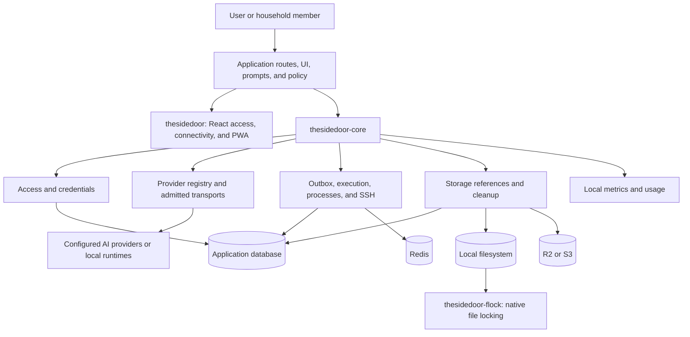
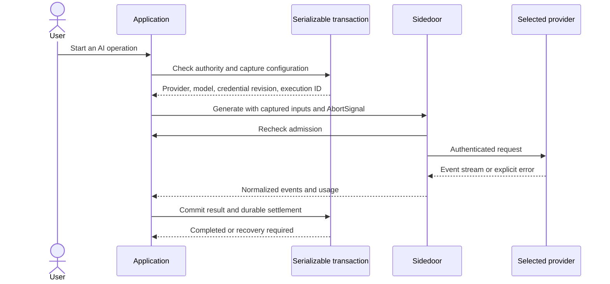
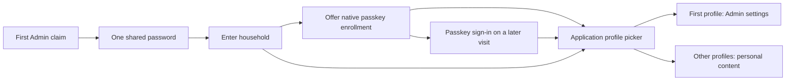
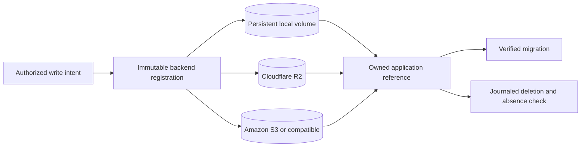
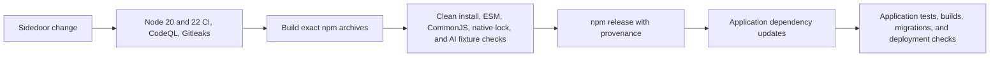

# Sidedoor

Shared TypeScript infrastructure for open-source, self-hosted AI applications. Users bring their own provider access and operators keep control of the server, database, files, credentials, and telemetry.

[](https://www.npmjs.com/package/thesidedoor-core)
[](https://www.npmjs.com/package/thesidedoor)
[](https://www.npmjs.com/package/thesidedoor-flock)
[](https://github.com/affromero/sidedoor/actions/workflows/ci.yml)
[](https://github.com/affromero/sidedoor/actions/workflows/codeql.yml)
[](https://github.com/affromero/sidedoor/actions/workflows/gitleaks.yml)
[](https://nodejs.org/)
[](https://github.com/affromero/sidedoor/blob/main/LICENSE)

Sidedoor puts the backend pieces shared by self-hosted AI products in versioned npm packages. A provider addition, passkey fix, storage safety change, or telemetry update can ship once and reach each application through a dependency update.

It is an embedded library. There is no central Sidedoor service, hosted control plane, or required account. Applications retain their product behavior, prompts, authorization policy, database, and deployment.

## What it provides

| Area         | Included behavior                                                                                                                                       |
| ------------ | ------------------------------------------------------------------------------------------------------------------------------------------------------- |
| AI providers | OpenAI, Anthropic, Google, OpenAI-compatible endpoints, Claude Code and Codex subscriptions, model discovery, streaming, tools, usage, and cancellation |
| Credentials  | Encrypted, revisioned credentials per owner, explicit household sharing, validation tickets, endpoint binding, and lost-response reconciliation         |
| Access       | Passwords, passkeys, sessions, recovery, invitations, profiles, device credentials, owner claim, and browser-safe HTTP schemas                          |
| Storage      | Local filesystem, Cloudflare R2, generic S3, immutable references, backend migration, multipart cleanup, deletion journals, and recovery evidence       |
| Work         | Transactional outbox records, durable execution journals, task loops, Redis capacity leases, local processes, SSH execution, and retained cleanup state |
| Operations   | Setup checks, notifications, private connectivity, QR codes, PWA helpers, local metrics, token accounting, and versioned pricing                        |

## Architecture



The application authenticates and authorizes each operation. Sidedoor captures the selected provider, credential revision, storage destination, execution identity, and other evidence needed to finish or recover that operation safely.



Read the [architecture guide](https://github.com/affromero/sidedoor/blob/main/docs/architecture.md) for authority boundaries, credential replacement, durable jobs, storage lifecycle, and telemetry rules.

## Packages

| Package                                                                | Install when you need                                                                         | Runtime                                                                      |
| ---------------------------------------------------------------------- | --------------------------------------------------------------------------------------------- | ---------------------------------------------------------------------------- |
| [`thesidedoor-core`](https://www.npmjs.com/package/thesidedoor-core)   | AI, access, credentials, storage, jobs, notifications, setup, metrics, processes, or SSH      | Node.js 22 or later                                                          |
| [`thesidedoor`](https://www.npmjs.com/package/thesidedoor)             | React access UI, private connection guides, URL resolution, QR codes, sharing, or PWA helpers | React 18 or later for React exports                                          |
| [`thesidedoor-flock`](https://www.npmjs.com/package/thesidedoor-flock) | Native OS locking for file-backed state                                                       | Installed as an optional core dependency; native compiler toolchain required |

All packages use the same version. Install the parts your application imports:

```bash
npm install thesidedoor-core thesidedoor
```

## Start with an AI request

```ts
import { ProviderRegistry } from 'thesidedoor-core/ai';
import { apiProviders } from 'thesidedoor-core/ai/providers';

const registry = new ProviderRegistry({
  providers: apiProviders(),
  credentials: {
    async resolve(provider) {
      const credential = await loadAuthorizedCredential(provider);
      return { apiKey: credential.apiKey, baseUrl: credential.baseUrl };
    },
  },
});

for await (const event of registry.generate({
  provider: selectedProvider,
  model: selectedModel,
  messages: [{ role: 'user', content: [{ type: 'text', text: prompt }] }],
  signal: request.signal,
})) {
  if (event.type === 'text') response.write(event.text);
}
```

The caller resolves credentials after authorization and keeps them on the server. The selected backend returns its own error if it fails. Applications make any alternative provider choice explicitly.

Run the complete [Node example](https://github.com/affromero/sidedoor/blob/main/examples/ai-text.mjs) against your provider:

```bash
SIDEDOOR_AI_PROVIDER=openai \
SIDEDOOR_AI_MODEL=gpt-5-mini \
SIDEDOOR_AI_API_KEY=... \
node examples/ai-text.mjs 'Explain why leaves change color.'
```

## Use Claude Code or Codex subscriptions

Sidedoor treats Claude Code and Codex as keyless CLI providers. They use the user's existing CLI subscription login instead of an API key. `thesidedoor-core/runtime/cli` decodes each command's structured output, returns answer text, rejects incomplete or conflicting terminal records, and reports the usage fields emitted by the CLI.

The application owns the process boundary. It installs the CLI, mounts its login directory, builds the command arguments, scrubs unrelated environment secrets, and persists refreshed OAuth files atomically. This keeps subscription credentials under the operator's control and lets each application choose local or SSH execution without copying authentication into Sidedoor's credential store.

```ts
import { ClaudeOutputDecoder, CodexOutputDecoder } from 'thesidedoor-core/runtime/cli';

const decoder = provider === 'codex' ? new CodexOutputDecoder() : new ClaudeOutputDecoder();
for await (const chunk of commandStdout) {
  for (const event of decoder.push(chunk)) {
    if (event.type === 'text') response.write(event.text);
    if (event.type === 'usage') recordUsage(event.usage);
    if (event.type === 'failure') throw new Error(event.message);
  }
}
for (const event of decoder.finish()) {
  if (event.type === 'usage') recordUsage(event.usage);
}
```

The [CLI subscription contract tests](https://github.com/affromero/sidedoor/blob/main/packages/core/tests/runtime/process/cli-subscription-contract.test.ts) cover both provider identities, the absence of API-key fields, answer extraction, terminal completion, and token accounting. Application integration tests remain responsible for their command arguments, credential mounts, refresh writeback, and SSH policy.

## Add password and passkey access

The core access service owns password verification, WebAuthn passkeys, sessions, recovery, invitations, profiles, and device credentials. Your application supplies the relying-party origin, HTTP mounting, storage transaction, and profile mapping.



The first Admin claim sets the shared password. After password entry, `AccessForm` offers to save a passkey with Apple Passwords or another WebAuthn manager. The visitor can skip this step. A saved passkey opens the same profile picker on later visits. Any admitted visitor can choose the Admin profile and change app settings. Choosing another profile removes that authority. Changing the shared password revokes household sessions and passkeys. Admin can manage passkeys and recovery codes in `AccessSecurity`. The [`access` modules](https://github.com/affromero/sidedoor/tree/main/packages/core/src/access) and [HTTP contract](https://github.com/affromero/sidedoor/blob/main/packages/core/src/access/transport/http.ts) show how to mount this flow. Public hosted apps that need separate account login can opt in with `allowPrincipalAccessInHousehold`.

## Choose storage

Local filesystem storage is a production option alongside R2 and S3. Every backend uses the same ownership, migration, and deletion model.



A backend change affects new writes. Existing references retain their recorded physical destination until a verified migration replaces them. See the [storage guide](https://github.com/affromero/sidedoor/blob/main/docs/storage.md).

## Add connection and install UI

```tsx
import 'thesidedoor/styles.css';
import { ConnectPanel } from 'thesidedoor/react';

export function ConnectPage() {
  return <ConnectPanel appName="My App" port="3000" />;
}
```

`ConnectPanel` renders a reachable URL, QR code, share controls, and home-screen instructions. It supports LAN, Tailscale, and an explicitly configured public endpoint. Importing Sidedoor does not create a tunnel or expose a port. See the [connectivity guide](https://github.com/affromero/sidedoor/blob/main/docs/connectivity.md) and [React example](https://github.com/affromero/sidedoor/blob/main/examples/react-usage.tsx).

## Metrics and privacy

Sidedoor records metrics through an explicit local sink. It starts no hosted exporter and sends no telemetry to the Sidedoor project. The event schema excludes prompt content, credentials, URLs, and raw exception messages. Applications choose identifiers, retention, persistence, and any export destination.

Token accounting records measured usage with a pricing version. Missing provider usage stays unknown. The library does not invent cost data.

## Integration map

| Goal                                                  | Reference                                                                                                                                                                                                                                        |
| ----------------------------------------------------- | ------------------------------------------------------------------------------------------------------------------------------------------------------------------------------------------------------------------------------------------------ |
| Understand package and application boundaries         | [Architecture](https://github.com/affromero/sidedoor/blob/main/docs/architecture.md)                                                                                                                                                             |
| Configure AI and add a provider                       | [Core package guide](https://github.com/affromero/sidedoor/blob/main/packages/core/README.md), [provider catalog](https://github.com/affromero/sidedoor/blob/main/packages/core/src/providers/catalog.ts)                                        |
| Use Claude Code or Codex subscriptions                | [CLI runtime](https://github.com/affromero/sidedoor/blob/main/packages/core/src/runtime/process/cli.ts), [contract tests](https://github.com/affromero/sidedoor/blob/main/packages/core/tests/runtime/process/cli-subscription-contract.test.ts) |
| Mount passwords, passkeys, sessions, and recovery     | [Access modules](https://github.com/affromero/sidedoor/tree/main/packages/core/src/access), [HTTP schemas](https://github.com/affromero/sidedoor/blob/main/packages/core/src/access/transport/http.ts)                                           |
| Store credentials per owner and share them explicitly | [Configuration modules](https://github.com/affromero/sidedoor/tree/main/packages/core/src/configuration)                                                                                                                                         |
| Use local files, R2, or S3                            | [Storage guide](https://github.com/affromero/sidedoor/blob/main/docs/storage.md)                                                                                                                                                                 |
| Run durable jobs and bounded workers                  | [Runtime modules](https://github.com/affromero/sidedoor/tree/main/packages/core/src/runtime)                                                                                                                                                     |
| Add local metrics and token accounting                | [Observability modules](https://github.com/affromero/sidedoor/tree/main/packages/core/src/observability)                                                                                                                                         |
| Add QR codes, private access, and PWA installation    | [Connectivity guide](https://github.com/affromero/sidedoor/blob/main/docs/connectivity.md)                                                                                                                                                       |
| Publish verified package archives                     | [Release operations](https://github.com/affromero/sidedoor/blob/main/docs/release.md)                                                                                                                                                            |
| Report a vulnerability                                | [Security policy](https://github.com/affromero/sidedoor/security/policy)                                                                                                                                                                         |
| Review shipped changes                                | [Changelog](https://github.com/affromero/sidedoor/blob/main/CHANGELOG.md)                                                                                                                                                                        |

## Distribution



Consumers use versioned npm dependencies rather than a Git submodule. Their lockfiles record the exact archive integrity. A consumer stays on its installed version until its operator upgrades it.

Release verification packs all three packages, serves those exact bytes through a temporary registry, installs them in a clean consumer, compiles the native locking dependency, checks ESM and CommonJS exports, exercises real file locking, and runs an AI request against a local fixture. The release workflow publishes the same retained archives in dependency order and verifies a fresh public install. See [release operations](https://github.com/affromero/sidedoor/blob/main/docs/release.md).

## Develop

Use Node.js 22 or later and a native compiler toolchain:

```bash
npm ci
npm run check
npm run format:check
npm run test:package-install
```

`npm run check` runs lint, strict type checks, unit and integration tests, release tests, and all package builds. The installed pre-commit hook rejects source files over 1,000 lines and new source files in directories that already contain 10 files.

Provider contributions must implement a working adapter for every declared capability. Include HTTP or process-boundary tests for success, rejection, timeouts, cancellation, and cleanup. Storage, access, credential, and execution changes must preserve authority and recovery evidence across lost responses.

## Used by

Sidedoor is the shared backend boundary for [Flight Finder](https://github.com/affromero/flight-finder), [Papernook](https://github.com/affromero/papernook), and [Sotto](https://github.com/affromero/Sotto). Their integration suites verify the package against flight search, document research, and language-learning workloads.

## Security and license

Report vulnerabilities through [GitHub private vulnerability reporting](https://github.com/affromero/sidedoor/security/advisories/new) or follow the [security policy](https://github.com/affromero/sidedoor/security/policy). Do not open a public issue for a suspected vulnerability.

Sidedoor is available under the [MIT License](https://github.com/affromero/sidedoor/blob/main/LICENSE).
