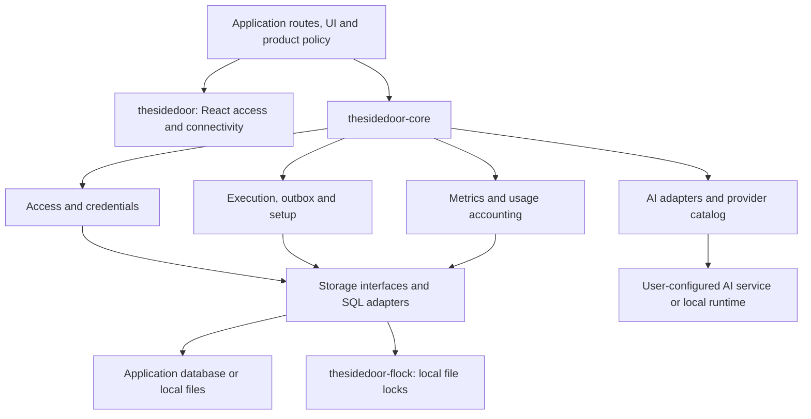
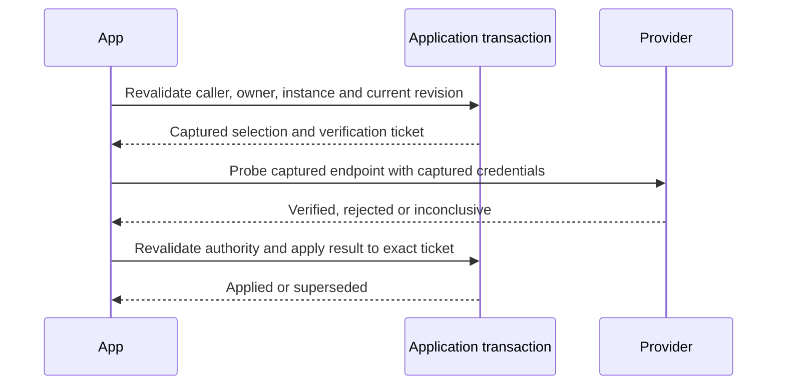

# Architecture

Sidedoor is a package monorepo. Apps embed its modules in their own server process and retain control of their data and deployment. There is no required central Sidedoor service.

This diagram groups public modules; it is not an assertion that every module imports every member of its group. The [core package exports](../packages/core/package.json) define the supported import surface.

## Ownership boundaries

| Sidedoor owns                                                                 | The application supplies                                                        |
| ----------------------------------------------------------------------------- | ------------------------------------------------------------------------------- |
| Provider protocol adapters, capability checks and shared credential metadata  | Product prompts, model selection and approved provider configuration            |
| Password/passkey/session primitives and access state                          | HTTP mounting, relying-party origin, user-facing policy and route authorization |
| Encrypted credential envelopes, revision checks and sharing records           | Secret key, canonical owner identity, grants and transaction boundary           |
| SQL persistence adapters, work journals and outbox primitives                 | Database connection, schema installation, job admission and worker lifecycle    |
| Bounded metric collection, event schema and usage accounting                  | Attribution, local sink, retention and explicit flush/shutdown handling         |
| Storage backend identity, reference ownership, migration and cleanup journals | Local root or object-store client, application consumers and authorization      |
| Reachable URL and installation components                                     | Hostname, proxy trust, network choice and application appearance                |

## AI requests

The server authenticates the caller, selects an allowed provider/model, and captures its endpoint and credentials. `ProviderRegistry` checks the requested capabilities and delegates to that provider's adapter. Adapters expose model discovery, readiness and an async stream of generation events.

Consume the stream to completion, or cancel it through the supplied `AbortSignal` or iterator cleanup. A failed selected backend surfaces an error. Product code must make any alternative selection explicitly.

The catalog distinguishes provider identity, credential authority and modality. A credential definition does not imply that every modality has a generation adapter. Validation also distinguishes authenticated proof, rejection, missing configuration and an inconclusive response. An outage is not evidence that a key was revoked.

## Credential changes

Per-owner credentials include the owner generation, instance identity, provider slot, endpoint binding and a unique revision. A replacement checks the expected head. Verification applies only to the revision and attempt it captured, so a delayed result cannot disable a replacement key.

The SQL credential methods require a caller-owned Serializable transaction. They do not independently authorize the user. The app must check the original admission, owner generation and erasure tombstones in the same transaction as the write. External provider requests occur outside retryable database transactions.

Household sharing is an explicit policy record. Personal credentials do not become shared merely because their owner has an administrator role. Removing a grant, converting a household profile to a private account, or deleting an owner must use the same canonical transaction as the access change.

## Persistence and background work

SQL adapters accept the application's executor. Local file persistence uses OS file locking through `thesidedoor-flock`; installation of that path requires its native build prerequisites. Importing core does not start a database, migrate data or create account authority.

Outbox work is admitted with the database change that requires it. Delivery can be retried and may repeat an external effect. Consumers use stable identities, completion checks and reconciliation appropriate to the receiving system. Remote cleanup can fail and remains recorded for recovery.

## Storage lifecycle

Local files, R2 and S3 use one reference and cleanup model. A backend registration
captures the physical destination before a write. Local registrations include the
canonical root, device and inode. Object registrations include endpoint, bucket,
credential revision, signing region and public URL encoding. A later configuration
change cannot redirect a historical read or deletion.

The app assigns every stored asset to named consumers and erasure scopes in its
Serializable transaction. Deletion retires those consumers, writes a tombstone,
records exact targets and removes application rows in the same transaction. The
cleanup runner drains admitted writes, takes an exclusive lock for each physical
backend, deletes bounded pages and verifies absence. Uncertain external results keep
their execution gate closed until the operator records evidence. See the
[storage guide](storage.md) for the integration contract.

## Metrics and telemetry

`MetricCollector` accepts an explicit sink. It does not start a network exporter or background timer. Its event schema excludes free-form prompt content, credentials, URLs and raw exception messages. The app still controls identifiers and must supply appropriate attribution.

Wire execution observation, persistence and lifecycle handling in the consumer. Flush pending events at defined boundaries and inspect dropped/rejected/write-failure counters. Unmeasured token usage remains unknown; cost estimates require an explicit pricing version. Installing the package alone does not make all application requests observable.

## Distribution

The release unit is an npm archive with public ESM, CommonJS and TypeScript exports. `thesidedoor-core` declares its native locking dependency; users do not manually copy that implementation. A consumer lockfile records the exact installed archives.

`scripts/verify-package-install.mjs` builds a temporary registry from packed artifacts and exercises a fresh consumer installation. It verifies archive integrity, dependency resolution, clean `npm ci`, React exports and actual file locking. App integration checks and public-registry acceptance are additional gates.

The release workflow verifies all three archives, retains them as a workflow artifact, then publishes those same bytes in dependency order with provenance. It preflights every version before publishing, and a retry skips only an already published archive with matching integrity. Public installation then checks the exact released archives from a fresh directory and cache. Publication and public-registry acceptance still need a real release run; local tests do not establish either result. See [release operations](release.md).
